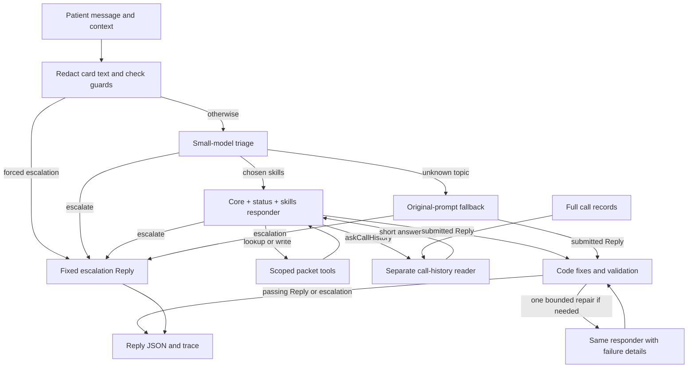

# Doctours reply system

## Summary

This system writes the Coordinator's Reply to a pre-deposit Patient's text, or escalates to an Operator. It replaces the packet's single prompt with guards, small-model triage, a shared core, one Pipeline Status module, and the skills needed for that message. One responder writes the final Reply. A separate reader handles full call records, and code checks non-escalation Replies before output.

The CLI accepts an array of `{id, text}` messages and returns one structured `Reply` per message, in the same order. The five packet examples are ordinary inputs; production code does not read the evaluation cases. The domain vocabulary is in [CONTEXT.md](CONTEXT.md).

The implementation is tested offline. Live default-mode acceptance, cache measurements, and the final before/after comparison are pending an API key. The historical baseline below is a real saved run. See the [completion checklist](docs/completion.md) for the remaining gates.

## How to run it

Use Node.js 22.9 or newer, npm, and an OpenAI API key with access to the configured models. From the repository root:

```sh
npm ci
cp .env.example .env
# Set OPENAI_API_KEY in .env using your editor.
npm run --silent respond -- examples/packet-messages.json > replies.json
```

`--silent` suppresses npm's script banner, leaving stdout as a JSON array. Application progress and errors go to stderr. The scripts load `.env` automatically; exporting the key in your shell also works. Keep `.env` out of git.

The default models are `gpt-6.1-sol` for the responder and `gpt-6-luna` for triage and the call-history reader. Set `RESPONDER_MODEL` or `TRIAGE_MODEL` to override them.

```sh
# The original prompt, with no triage or validator, for the before comparison.
npm run --silent respond -- --mode baseline examples/packet-messages.json

# A new Patient with no name, procedure area or photos.
npm run --silent respond -- --context evals/contexts/lead.json examples/lead-messages.json

# stdin and an explicit output file also work.
cat examples/packet-messages.json | npm run --silent respond -- --out replies.json

npm test
npm run typecheck
npm run eval
npm run eval -- --mode baseline
npm run eval -- --cases generalization --cases escalation --repeat 3
npm run demo                    # Real five-message CLI run; requires a key.
npm run demo -- --offline       # Guard-only demo; no model calls or real key.
```

A context file is validated JSON. Missing fields inherit the packet values, except omitted collection status is derived from the supplied intake state. Its `toolOverrides` map supplies Patient-specific tool results. Override any packet result that would contradict the new Patient. See [Patient context and fixtures](docs/runtime.md#patient-context).

The packet tools are fixture functions, not live clinic or payment integrations. Each input message runs independently against its selected context. Returned `workingMemoryUpdates` do not update subsequent messages automatically. Up to four messages run concurrently.

Each message writes a trace under `traces/<runId>/`. Filenames use bounded, sanitized message ids, with suffixes reserved case-insensitively to prevent overwrites. Failed drafting escalates that message after SDK retries; configuration failures such as a missing or rejected key stop the run with a nonzero exit. See [runtime details](docs/runtime.md) for retries, tools, skills and trace fields.

## Architecture



Triage selects skills; code selects the Pipeline Status module. The registry resolves skill dependencies and exposes only their tools, plus `loadSkill`, `escalate` and `submitReply`. A missing skill can load mid-turn. Memory updates travel in the Reply rather than a separate memory-write tool.

[ADR 0001](docs/adr/0001-triage-before-responder.md) explains triage before drafting. [ADR 0003](docs/adr/0003-call-history-reader.md) explains the separate reader: full transcripts stay outside the responder's context. A failed reader escalates the message rather than letting the responder guess.

The trace records the path, triage decision, initially resolved and later loaded skills, filled prompts, tool inputs/results, reader record, validation fixes and checks, selected Reply, and each model call's tokens and latency. The shared model-call list accounts for reader usage once.

## What loads on every turn

| Path or component | Loaded content | Token evidence |
|---|---|---|
| Guard escalation | Code only | Zero model tokens. |
| Triage | Escalation policy, skill index, state card, four recent chat turns, incoming message | API measurement pending. |
| Responder core | Voice, grounding, links, precedence, Reply fields, skill index, state card, memory and recent chat | Packet fixture has 11,545 characters. Existing budget test estimates about 2,886 tokens; exact model-token verification is pending. |
| Pipeline Status module | One module chosen by code | PRE_CLINICAL_SENT has 1,592 characters; model-token measurement pending. |
| Skills and tools | Chosen skills, required dependencies, and their tool schemas | Varies by message. Saved evals now report median loaded skills and total input tokens. |
| Call-history reader | Reader rules, question and full call records | Only when requested; usage is recorded under the parent message. |
| Explicit baseline | Original filled prompt and all packet tools on each tool round | Historical packet run used 536,458 input tokens across five messages, median 114,455 per message. |

Character counts are source measurements, not billed tokens. The core budget's characters-divided-by-four check is a heuristic, not proof of the exact 3,000-token limit. Total usage includes model framing, tool schemas, multiple tool rounds, triage, reader calls and repair.

The responder has explicit cache endpoints before Patient context, after the full core, and after the status module. Skills follow them. Implicit caching remains enabled for later tool rounds. Changed tools or earlier context can prevent reuse. `PROMPT_CACHE=off` removes these explicit endpoints while retaining provider automatic caching. See [caching and trim notes](docs/optimization.md).

## Escalation

[ADR 0002](docs/adr/0002-escalation-boundary.md) defines the boundary. Requests for a person or call, card charging, moving or refunding paid money, holding dates, matching direct quotes, opt-outs, legal threats, and repeated requests for clinic contact details escalate. Covered informational questions continue to a Reply.

Guards catch card-like digit runs and explicit person requests without a model call. Triage handles paraphrases before any sales reply exists. Code always renders `I'm getting a person for you.` It fills the escalation fields and stops. A responder can also escalate mid-turn; default-mode fallback escalations use the same builder. Repair can escalate when it discovers a need for an Operator. An escalation ends the turn immediately; it can never become a sales Reply.

Default mode redacts card-like text in incoming messages, history and tool results while preserving complete UUIDs. Baseline mode retains the original prompt behavior for comparison. Ashwin reviewed and accepted the [18 escalation decisions](docs/escalation-review.md).

## Before and after, and the eight problems

The historical run is [2026-10-02T00-31-24.474Z](evals/results/2026-10-02T00-31-24.474Z.json), baseline mode with `gpt-6.1-sol`. It covers only the packet's five cases. Every number in this table comes from that saved scorecard; the median input value is calculated from its five per-case counts.

| Packet check metric | Historical baseline | Final default |
|---|---:|---:|
| Passed cases | 2/5 | Pending |
| Pass rate | 40% | Pending |
| Total input tokens | 536,458 | Pending |
| Total output tokens | 1,599 | Pending |
| Median input tokens per message | 114,455 | Pending |
| Median latency per message | 14.035 seconds | Pending |

The baseline omitted Heva's deposits and assessment link, omitted the consultation link, and did not escalate the card-charge request. A matched full-suite comparison is also pending. The current suite has 96 cases in 14 files. Do not compare its totals with the five-case historical run.

```sh
npm run eval -- --mode baseline --cases packet-check
npm run eval -- --cases packet-check
npm run eval -- --compare <packetBaselineRunId> <packetDefaultRunId>

npm run eval -- --mode baseline
npm run eval
npm run eval -- --compare <fullBaselineRunId> <fullDefaultRunId>
```

Replace the angle-bracket arguments with saved run ids. Rerun the baseline: the current checks now verify package-to-price/deposit attribution and the stricter one-sentence escalation requirement, so the historical scorecard is not a matched comparison. New scorecards record commit, case/context hash, token and cache usage, median input, skill counts, fallbacks and repairs. Baseline scoring skips skill-selection checks and requires `getFullCallsTool` where default mode requires `askCallHistory`. All other Reply and tool-call checks apply to both modes. Package checks bind each price and deposit to its named package, rather than merely checking that all the numbers appear. The checker is a conservative text heuristic; ambiguous grouped wording needs human review. New scorecards retain the complete Reply as well as the scored checks.

The following rows follow the [source brief's eight concerns](docs/brief.md) in order.

| Original concern | What changed and what remains |
|---|---|
| 1. Irrelevant rules crowd the context | Triage chooses skills; the responder loads the core, one status module and those skills. Live quality evidence is pending. |
| 2. Traces cannot isolate the source of a wrong reply | Traces expose routing, loaded rule text, tool evidence, validation and reader calls. They narrow the search; they do not prove which sentence in a prompt caused a model output. |
| 3. Another line of care expands the same monolith | Skill files, declared dependencies, tools and source references provide places to add a domain. Fertility is not implemented; shared state and tooling still need review when adding it. |
| 4. Subtasks have nowhere to go | `askCallHistory` runs a separate reader and returns a short result. Full transcripts never enter the skill responder's context. |
| 5. Every message pays for the full prompt | Guards use no model; skill Replies use selected rules and explicit cache endpoints. Real token and latency improvements remain to be measured. |
| 6. Policy changes affect unrelated replies | Rules live in topic skills, with scoped tools and per-skill eval groups. The shared core still affects every skill Reply and needs regression coverage. |
| 7. Conflicting rules have no recorded resolution | The core declares precedence and skills declare overrides. Loaded prompts and overrides appear in traces. There is no causal record proving which rule the model followed. |
| 8. Individual behaviors cannot be tested | Unit tests cover routing, tools, schema, guards and validation separately. Live cases have named checks for prices, links, fields, escalation, skills and tool calls, so failures have specific reasons. |

## Trade-offs and next steps

Triage adds a model round trip. Scoped tools save context but changing the tool list can lose cache reuse. The core includes Patient state and history, so later cache endpoints depend on that data staying stable. The separate reader adds latency only for call questions. Unknown topics retain a traced baseline fallback; the supported eval suite must have zero such fallbacks before acceptance.

The validator deterministically fixes formatting, field consistency and ungrounded URLs. It filters attachments to URLs returned by tools this turn and keeps at most three, including when repair fails. It then permits one bounded repair. A Reply ships only when every validation check passes; persistent failures, malformed repairs and exhausted repair rounds produce a fixed escalation. Model-requested escalations during repair are honored. The checks catch known failure patterns, not every possible factual error; live evaluation and trace review are still necessary.

No skill text has been trimmed because each trim requires a live comparison. AW-101's caching and measurement code is implemented; measured savings and the trim pass remain pending. The call-history reader was retained. The model provider is OpenAI, including the small-model roles that earlier planning called Haiku. Reviewer invitations were excluded at Ashwin's request.

Complete the [live acceptance and handoff checklist](docs/completion.md), publish the selected scorecards, fill the pending measurements above, and run all five packet messages from a fresh clone. See the [submission plan and evidence guide](docs/submission.md) for the current fixes, demo artifacts and live acceptance commands. The [integration review](docs/integration-review.md) records the defects found and fixed across the original stack. Ashwin authorized merging the stack before live acceptance; Linear issues remain In Progress until their pending criteria are satisfied.
